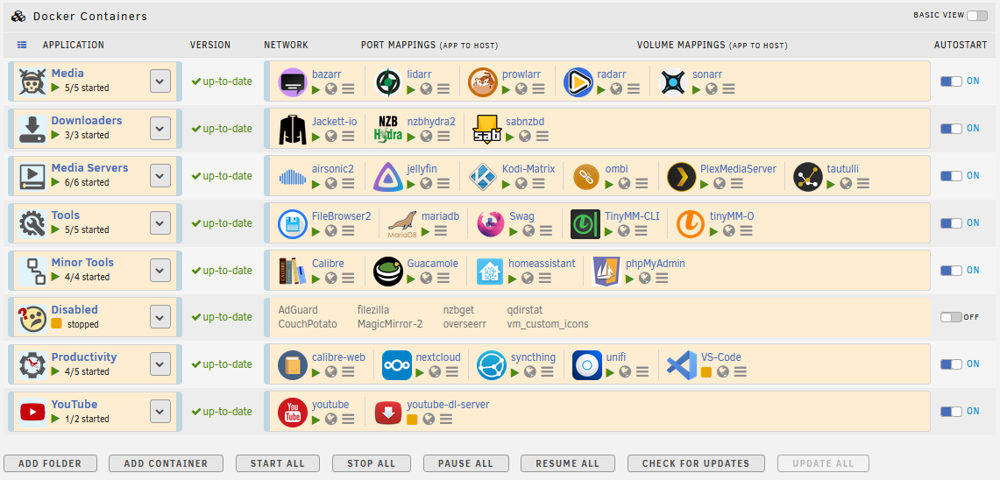
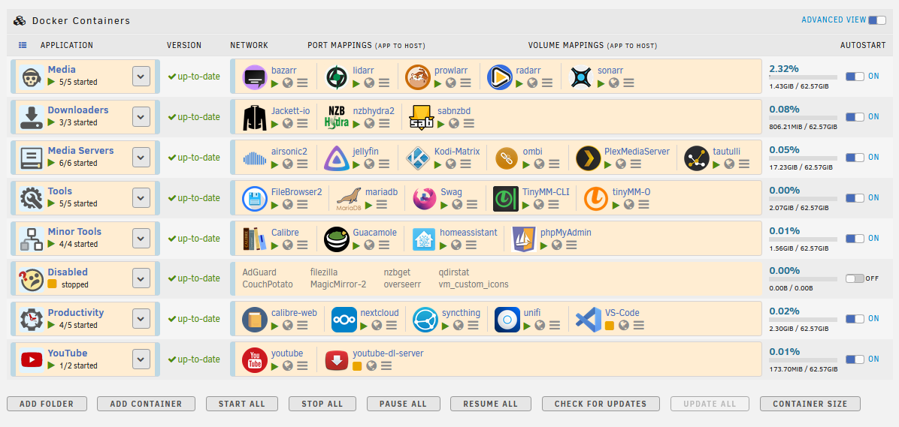
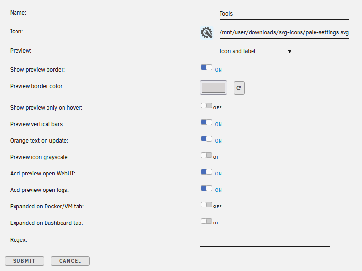

# Folder.View UI Customizations

Custom Folder.View GUI modifications to the amazing Folder.View plugin for unRAID by scolcipitato.

Special thanks to scolpitato for creating and continuing with the Docker page modification that groups your Docker icons into custom folders of your choosing. This plugin makes the Docker GUI page less cluttered and more organized. He has been very helpful in accommodating changes to his code to allow individuals to make the customizations.

### UPDATE August 17, 2023
Added code to the Advanced View. Minimized the non-visible "Uptime" column to take less space. Styled the CPU/Memory block and made narrower.

Here is a link to the the **[Folder.View](https://github.com/scolcipitato/folder.view/tree/main)** repo:

Here is a link to the plugin's **[Support Page](https://forums.unraid.net/topic/142782-plugin-folderview/)** on the unRAID forum:

If you have customization suggestions, please drop me a line in the unRAID forum.

To implement a customization, you must have the Folder.View plugin installed in your unRAID server. Simply copy the appropriate "docker-custom.css" file into your Flash drive's **/boot/config/plugins/folder.view/styles** folder.  

Below are my typical settings for each FolderView.
